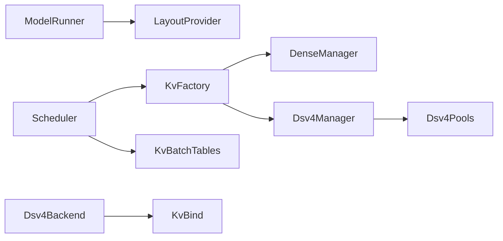

# DSV4 KV Cache 重组执行计划

> **状态**: v3 已实施（2026-07-29，CPU 门禁见 §0）
> **基线分支**: `feat/csa-swa-fusion`
> **目标**: 将 DSV4 KV cache 从 `BlockManager`、`ScheduledBatch` 和巨型 attention 文件中解耦，同时保持现有 dense、SWA、CSA snapshot、unified arena 与 offload 行为不变。

---

## 0. 实施结果与偏差

阶段 1–8 已按顺序落地，新增的确定性门禁包括：

- `test_dsv4_kv_bind.py`
- `test_dsv4_batch_tables.py`
- `test_kv_cache_layout.py`
- `test_pooled_free_list.py`
- `test_kv_cache_manager_contract.py`
- `test_windowed_kv_pool.py`

最终实现保持 `atom/kv_cache/__init__.py` 无 eager re-export，Scheduler
只依赖 `KvCacheManager` Protocol/factory，attention backend 继续接收完整
`ScheduledBatch` 并从 `kv_batch_tables` 读取物理表。

实施偏差（为兼容现有外部调用而保留）：

1. 通用 primary lifecycle 的兼容 core 仍定义于历史
   `atom/model_engine/block_manager.py`；`BaseKvCacheManager`、Dense 和 DSV4
   concrete managers 在新包建立真实 factory 边界。Scheduler 已不再导入旧路径。
2. `Scheduler.block_manager` property 继续作为外部兼容 alias，并允许测试/connector
   注入 manager；Scheduler 内部 canonical owner 是 `kv_cache_manager`。
3. GPU 门禁需要 ROCm PyTorch/AITER 模型运行环境；当前 CPU agent 环境只执行
   确定性 CPU 门禁，不能用 skip 冒充 GPU 验证。

---

## 1. 目标架构

### 1.1 分层原则

| 层 | 包路径 | 职责 |
|----|--------|------|
| **控制面** | `atom/kv_cache/` | manager、factory、protocol、layout、batch 物理表、通用 pool 原语 |
| **数据面** | `atom/model_ops/attentions/dsv4/` | KV tensor binding、attention backend 相关 DSV4 逻辑 |
| **调度** | `atom/model_engine/scheduler.py` | 只依赖 `KvCacheManager` Protocol，不直接读 `.swa`/`.arena` |
| **内存预算** | `ModelRunner` + builder layout capability | 不出现 DSV4 architecture 分支 |

### 1.2 组件关系



### 1.3 目标目录结构

```text
atom/kv_cache/                          # 中立控制面包（__init__.py 不做 eager re-export）
├── __init__.py
├── protocol.py                         # KvCacheManager Protocol
├── factory.py                          # make_kv_cache_manager(config)
├── layout.py                           # KvPoolLayout + 默认单池 layout
├── batch.py                            # 通用 KvBatchTables
├── base_manager.py                     # 通用 chained hash / primary lifecycle / KV events
├── dense_manager.py                    # Dense 实现
├── dsv4/
│   ├── manager.py                      # DSV4 manager
│   ├── compressed_pool.py              # compressed free-list（继承 PooledFreeList）
│   ├── swa_pool.py                     # CSA-into-SWA / arena lockstep
│   ├── arena.py                        # DSV4 group/schema/physical mapping（组合 ChunkArena）
│   ├── batch_tables.py                 # DSV4 物理表构建
│   └── layout.py                       # fixed split / full-retain / unified arena
└── pools/
    ├── chunk_arena.py                  # 通用 byte-chunk free-list（自 model_engine 迁入）
    ├── pooled_free_list.py             # backed/unbacked pop/dealloc 原语
    └── windowed_kv_pool.py             # 通用 window/tail/admission 生命周期

atom/model_ops/attentions/dsv4/
└── kv_bind.py                          # build_kv_cache_tensor 拆分产物

atom/model_engine/
├── scheduler.py                        # 只调 Protocol，无 inline DSV4 表翻译
├── model_runner.py                     # 通过 compute_kv_pool_layout 做 sizing
└── block_manager.py                    # 兼容 shim / re-export（Scheduler 不再依赖）
```

### 1.4 关键不变量

- **logical `-1` 与 unbacked block 必须映射为 `-1`**，绝不能 fallback 到 `0`（CSA state 写错位置）。
- **arena-on 时 `_arena_group_rows` 必须被设置**；否则 SWA row stride 静默退化为 `block_size`。
- **indexer FP8 绑定必须覆盖 `idx_kv_f32.storage_offset() + scale_fp32_offset`**。
- **`atom/kv_cache/__init__.py` 不做 eager re-export**，避免 Scheduler ↔ backend 循环依赖。
- **非 V4 module fallback 必须显式调用** `CommonAttentionBuilder.build_kv_cache_tensor`（不能用 `super()`）。
- **backend 继续接收完整 `ScheduledBatch`**，不能错误替换为 arena-only view。

---

## 2. 现状问题（简述）

DSV4 KV cache 当前散落在四层：

```text
控制面                              数据面
─────────────────────               ────────────────────────────────
model_engine/scheduler.py           model_ops/attentions/deepseek_v4_attn.py
  arena/SWA/CSA 物理表翻译            build_kv_cache_tensor (~236 行单体)
  swa.materialize_window              AttentionMetaData + forward (~3500 行)

model_engine/block_manager.py       model_ops/v4_kernels/
  compressed pool + SWA + arena       state_writes, compress_plan, …

model_engine/{swa_pool,unified_kv_arena,chunk_arena}.py
```

主要症状：通用 `BlockManager` 无条件构造 DSV4 机器；`ScheduledBatch` 堆 4 种物理表翻译；
`build_kv_cache_tensor` 三维正交分派难 review；free-list 在 BlockManager 与 SWA pool 间重复。

---

## 3. 分阶段执行计划

> **执行方式**: 每阶段作为独立 review 单元；只有上一阶段的确定性测试与回归门禁通过后才进入下一阶段。
> **Agent 指引**: 推荐使用 `superpowers:subagent-driven-development` 或 `superpowers:executing-plans` 逐 task 实施。

---

### 阶段 1 — 固化行为并拆出 KV tensor binding

**目标**: 数据面可读性；为 `dsv4/kv_bind.py` 打地基（decompose-then-move，非纯 lift-and-shift）。

- [ ] 在 `tests/test_dsv4_kv_bind.py` 新增 characterization tests，覆盖：
  - V4 attention、indexer、indexer-inner compressor
  - C4 main、C128 main、DSpark draft
  - 非 V4 superclass fallback
- [ ] 对每个绑定 view 断言 `shape/stride/storage_offset/dtype`
- [ ] arena-on 时断言 `_arena_group_rows` 总被设置
- [ ] indexer FP8 覆盖 `idx_kv_f32.storage_offset() + scale_fp32_offset`
- [ ] 从 `deepseek_v4_attn.py:1013-1250` 删除两个已确认的死 local（独立、可回退 commit）
- [ ] 在原文件内把单体拆成：
  - `_bind_v4_attention`、`_bind_v4_indexer`、`_bind_indexer_inner_compressor`
  - `_bind_main_compressor_c4`、`_bind_main_compressor_c128`（保持 C4/C128 分支分离）
  - `_swa_row_stride`
- [ ] 将 helper 迁入 `atom/model_ops/attentions/dsv4/kv_bind.py`
- [ ] 原方法仅保留函数内 lazy import wrapper
- [ ] 三个 `atom.models.deepseek_v4` 类型 import 继续保持 lazy
- [ ] fallback 显式调用 `CommonAttentionBuilder.build_kv_cache_tensor`

**门禁**:

```bash
python -m pytest tests/test_dsv4_kv_bind.py -q
```

**估时**: 2–3 天

---

### 阶段 2 — 抽离 batch 物理表并消除运行时反向 import

**目标**: `ScheduledBatch` 瘦身；DSV4 物理表翻译集中在一处；消除 attention backend 对 scheduler 的运行时反向 import。

- [ ] 新建中立包 `atom/kv_cache/`（`__init__.py` 不做 eager re-export）
- [ ] 新建 `atom/kv_cache/batch.py` 的通用 `KvBatchTables`
- [ ] 新建 `atom/kv_cache/dsv4/batch_tables.py` 的 DSV4 构建函数
- [ ] 将 `scheduler.py:400-454` 的 arena/SWA/CSA 翻译移入构建函数
- [ ] 保留 logical `-1` 与 unbacked block → `-1` invariant
- [ ] `ScheduledBatch` 接收 `kv_batch_tables`，保留现有字段 alias 作为迁移兼容层
- [ ] 普通 batch 使用空 `KvBatchTables`
- [ ] 新增 `tests/test_dsv4_batch_tables.py`，覆盖：
  - arena off、各 group physical table
  - unbacked source、logical `-1`
  - main/idx 共用 c4 page
- [ ] Fix-then-sweep：`atom/model_ops/attentions/` 内所有仅用于类型标注的 `ScheduledBatch` import 改为 `TYPE_CHECKING` + postponed annotations

**门禁**:

```bash
python -m pytest tests/test_dsv4_batch_tables.py tests/test_scheduler.py -q
```

**估时**: 0.5–1 天

---

### 阶段 3 — 建立 architecture-agnostic KV layout provider

**目标**: `ModelRunner` 通过 builder 通用 capability 做内存预算，禁止新增 `_is_dsv4` 分支。

- [ ] 在 `atom/kv_cache/layout.py` 定义 `KvPoolLayout` 与默认单池 layout 计算接口
  - 结果包含：primary blocks、SWA blocks/window、arena specs、manager kind
- [ ] 在 `atom/model_ops/attentions/backends.py` 增加默认 `compute_kv_pool_layout(...)` capability
- [ ] 在 `atom/kv_cache/dsv4/layout.py` 实现三种 DSV4 layout：
  - fixed split、full-retain、unified arena
- [ ] DSV4 builder override 仅提供已实例化后端掌握的 layer partitions、dtype、SWA bytes、arena geometry
- [ ] `ModelRunner.get_num_blocks()` 先累计 target + optional draft `block_bytes` 与 per-request state，再调用通用 capability
- [ ] 在 `atom/config.py` 显式声明 layout 输出字段
- [ ] 在 `engine_core.py:88-110` 传播 `manager_kind/num_swa_blocks/swa_window_size/arena_specs` 后再创建 Scheduler
- [ ] 新增 `tests/test_kv_cache_layout.py`，覆盖：
  - dense 默认、DSV4 fixed/full-retain/arena
  - per-request deduction、target + draft bytes 不被漏算

**门禁**:

```bash
python -m pytest tests/test_kv_cache_layout.py tests/test_per_req_cache_decoupling.py -q
```

**估时**: 2–3 天

---

### 阶段 4 — 抽通用 pool 原语

**目标**: 去重 free-list 实现；为后续 manager 拆分做准备。

- [ ] 将 `atom/model_engine/chunk_arena.py` 迁至 `atom/kv_cache/pools/chunk_arena.py`，旧路径保留 re-export shim
- [ ] 新建 `atom/kv_cache/pools/pooled_free_list.py`
  - 只抽取 backed/unbacked queue membership、used IDs、`pop/dealloc` 机制
  - hash、event、retention、arena sibling eviction **不进入 base**
- [ ] 现有 `BlockManager` 与 `SlidingWindowPool` 使用该原语
- [ ] 新增 `tests/test_pooled_free_list.py`，覆盖：
  - stale deque entry、backed-first、unbacked fallback
  - 双重释放、ID conservation

**门禁**:

```bash
python -m pytest tests/test_pooled_free_list.py tests/test_chunk_arena.py tests/test_block_manager_arena.py -q
```

**估时**: 2–3 天

---

### 阶段 5 — 引入 Protocol/factory，并清除 Scheduler reach-through

**目标**: Scheduler 只依赖 Protocol；消除对 `.swa`/`.arena` 的直接 reach-through。

- [ ] 在 `atom/kv_cache/protocol.py` 定义真实 call-site 所需接口：
  - allocation/append/hash/deallocate/events
  - `block_size`
  - window lifecycle 三个方法：`materialize_window`、`ensure_window_for_tokens`、`finish_prefill_chunk`
  - `build_batch_tables`
  - Protocol **不暴露**具体 `.swa` 或 `.arena`
- [ ] 在现有 `BlockManager` 上先增加上述委托方法（dense 情况均为 no-op/空表）
- [ ] 修改 `scheduler.py` 所有 `.swa.*`、`.arena` 与 inline CSA source 收集 call-site，统一走 Protocol
- [ ] 保留只读 `block_manager` property alias 作为短期兼容，**不做代理子对象**
- [ ] 新建 `atom/kv_cache/factory.py`，初期仍可返回当前实现
- [ ] 新增 `tests/test_kv_cache_manager_contract.py` 固化 Scheduler 所需 surface

**门禁**:

```bash
python -m pytest tests/test_kv_cache_manager_contract.py tests/test_scheduler.py tests/test_prefill_scheduler.py tests/test_kv_events.py -q
```

**估时**: 3–4 天

---

### 阶段 6 — 拆分 Dense 与 DSV4 manager

**目标**: 真正分离 Dense/DSV4 实现；Factory 按 `manager_kind` 分发。

- [ ] 将通用 chained hash、primary block lifecycle、DCP 计数、per-request slots、KV events 移到 `atom/kv_cache/base_manager.py`
- [ ] 新建 `atom/kv_cache/dense_manager.py`
  - 固定物理 primary pool，window hooks 为 no-op，batch tables 为空
- [ ] 新建 `atom/kv_cache/dsv4/manager.py` 与 `compressed_pool.py`
  - 承接 compressed/SWA prefix gate、CSA source、arena borrow、lockstep lifecycle
  - compressed pool 必须使用 `PooledFreeList`，不能遗留第三份队列实现
- [ ] Factory 根据 layout 产出的 `manager_kind` 返回 Dense 或 DSV4 实现
- [ ] 旧 `atom/model_engine/block_manager.py` 保留兼容构造/re-export，但 Scheduler 不再依赖它
- [ ] 将现有测试分别参数化到 Dense 和 DSV4 manager
- [ ] arena 测试改为通过 DSV4 manager 的公开 invariant helper 检查 ID conservation

**门禁**:

```bash
python -m pytest tests/test_block_manager.py tests/test_block_manager_arena.py tests/test_unified_kv_arena.py tests/test_kv_events.py tests/test_per_req_cache_decoupling.py -q
```

**估时**: 5–7 天（最大 phase，建议单独 PR）

---

### 阶段 7 — 完成 DSV4 pool 子类与 arena 组合

**目标**: pool 层通用 base + DSV4 子类/组合；arena 语义迁入 `dsv4/arena.py`。

- [ ] 在 `atom/kv_cache/pools/windowed_kv_pool.py` 提取通用 window/tail/admission/content-hash 生命周期
- [ ] 在 `atom/kv_cache/dsv4/swa_pool.py` 保留：
  - CSA-into-SWA、checkpoint retention
  - arena sibling eviction、lockstep 语义
  - 旧 `model_engine/swa_pool.py` 留 re-export shim
- [ ] 将 `unified_kv_arena.py` 的 DSV4 group/schema/physical mapping 迁入 `atom/kv_cache/dsv4/arena.py`
  - 通过**组合**通用 `ChunkArena` 实现，**不继承**它
- [ ] 新增/扩展测试覆盖：
  - C4/C128/dense group
  - partial allocation rollback
  - 双向 sibling borrowing、backed-free credit、livelock
  - 重复 borrow/deallocate/reallocate 的 ID conservation

**门禁**:

```bash
python -m pytest tests/test_pooled_free_list.py tests/test_chunk_arena.py tests/test_unified_kv_arena.py tests/test_block_manager_arena.py -q
```

**估时**: 3–5 天（建议拆 PR-7a/7b/7c，风险递增）

---

### 阶段 8 — 清理、文档与端到端门禁

**目标**: 删除迁移期 alias；更新文档；CPU/GPU 全量验证。

- [ ] 删除所有迁移期字段 alias 和不再使用的 imports
- [ ] 保留外部兼容 shim
- [ ] 更新 `docs/scheduling_kv_cache_guide.md`
- [ ] 更新 `docs/architecture_guide.md`
- [ ] 更新本文档，记录最终结构与迁移偏差

**CPU 门禁**:

```bash
python -m pytest tests/test_dsv4_kv_bind.py tests/test_dsv4_batch_tables.py \
       tests/test_kv_cache_layout.py tests/test_kv_cache_manager_contract.py \
       tests/test_block_manager.py tests/test_block_manager_arena.py \
       tests/test_unified_kv_arena.py tests/test_scheduler.py \
       tests/test_compress_plan.py -q

ruff check <变更路径>
black --check <变更路径>
```

**GPU 门禁**（不得用 bare pytest skip 代替）:

```bash
rm -rf /root/.cache/atom/*

# 1. CSA boundary snapshot
python tests/test_csa_boundary_snapshot.py

# 2. TP4 fp8 server boot
#    arena off/on × CSA snapshot off/on

# 3. GSM8K forced-prefix-hit n=150

# 4. C128 long-context smoke（检查 storage-offset/stride 静默错绑）

# 5. 若 KV connector 可用：
#    prefix checkpoint save → 新请求 load → suffix prefill
```

**估时**: 2–3 天

---

## 4. PR 切分建议

| PR | 阶段 | 内容 | 风险 |
|----|------|------|------|
| PR-0 | 1 | 删死代码（`num_blocks`/`arena_num_chunks`），独立于 relocation | 极低 |
| PR-1 | 1 | decompose + `dsv4/kv_bind.py` + characterization tests | 低–中 |
| PR-2 | 2 | `atom/kv_cache/` + batch tables + `-1` invariant 单测 | 低 |
| PR-3 | 3 | layout provider + `compute_kv_pool_layout` | 中 |
| PR-4 | 4 | `PooledFreeList` + `ChunkArena` 迁移 | 中 |
| PR-5 | 5 | Protocol/factory + Scheduler reach-through 清理 | 中 |
| PR-6 | 6 | Dense/DSV4 manager 拆分 | **中–高** |
| PR-7a/b/c | 7 | pool 子类 + arena 组合（分步） | 中–高 |
| PR-8 | 8 | 清理 + 文档 + 端到端验证 | 低 |

**原则**: revert 保证在 forward stack 顺序成立；PR-6 是唯一「大改」PR，需完整 GPU + 确定性 oracle 验证。

---

## 5. 验证基线

### 5.1 确定性 oracle（硬门，GSM8K 不可替代）

1. **bind 结构 oracle（阶段 1）**: 对固定 module 集合逐 view 断言 `shape/stride/storage_offset/dtype`；非 V4 module 确认基类兜底仍 fire。

2. **batch tables `-1` invariant（阶段 2）**: logical `-1` 与非 SWA-backed block 映射到 `-1`（不是 0）。

3. **layout sizing oracle（阶段 3）**: target + draft bytes 不被漏算；per-request state 正确扣除。

4. **ID conservation（阶段 4/7）**: arena 借还、重复 borrow/deallocate/reallocate 后 ID 守恒。

### 5.2 注意事项

- TP4 fp8 greedy 不可复现（MoE 非确定性）；不走 token-exact A/B。
- `storage_offset` 错绑是**静默** bug，只在长上下文让 FP8 indexer logits 崩；必须靠结构 oracle 兜。
- 任何 server/GPU 重启前：`rm -rf /root/.cache/atom/*`。

---

## 6. 非目标

- 不改 `v4_kernels/` 算法语义（含 CSA capture/restore kernel）
- 不改 unified_kv arena 借还策略
- 不合并 c4/c128 的 `build_kv_cache` 分支
- 不在阶段 1–7 做 `state_writes.py` 文件拆分
- 不改变 LMCache offload unit 格式
- 不追求与 vLLM API 兼容；只对齐**分层思想**

---

## 7. 与 vLLM 的对齐参考

vLLM V1 分工（参考 `021-dsv4-kv/vllm`）:

```text
v1/kv_cache_interface.py          ← cache spec 声明
v1/core/kv_cache_coordinator.py   ← 多 group 协调 + prefix cache
models/deepseek_v2.py             ← 模型声明需要哪些 spec
v1/attention/backends/mla/        ← SWA / compressor 后端
v1/kv_offload/                    ← 通用 offload 框架
```

Atom 对应:

```text
atom/kv_cache/layout.py           ← cache spec / layout（≈ kv_cache_interface）
atom/kv_cache/{dense,dsv4}/manager.py  ← 控制面（≈ coordinator）
atom/model_ops/attentions/dsv4/kv_bind.py  ← tensor 绑定
atom/model_ops/attentions/dsv4/backend.py  ← attention metadata + forward
atom/kv_transfer/offload/         ← 通用 offload（布局无关，不搬入 dsv4/）
```

---

## 8. 开放问题

1. **`WindowedKvPool` 通用 base 的第二消费者**: 今天只有 DSV4 走 KV pool SWA；gpt_oss/llama 的 SWA 走 attention backend masking。阶段 7 落地前确认是否确有模型会引导到此 base。

2. **per-req cache group / GDN ring buffer 归属**: 须 spike 确认是否触碰 DSV4 arena/SWA 状态，再决定留 `base_manager` 还是 DSV4 manager。

3. **vLLM plugin 路径**（`atom/plugin/vllm/`）: 阶段 5–6 会改 manager 接口与 `get_num_blocks()`；须 pre-spike grep plugin bridge 引用。

4. **Dense manager 的 `.swa`/`.arena` 成员**: Dense 必须保留 disabled/None 成员，否则 scheduler 通用路径 AttributeError（即使语义为空）。

---

## 9. 相关文档

- `CSA_SWA_FUSION_REFACTOR_PROPOSALS.md` — P1–P5 对抗式验证细节
- `UNIFIED_KV_ARENA_PLAN.md` — arena 借还语义
- `CSA_SNAPSHOT_VALIDATION.md` — CSA restore 正确性基线
- `docs/scheduling_kv_cache_guide.md` — 当前 BlockManager API 文档（阶段 8 后需更新）
- `docs/architecture_guide.md` — 架构总览（阶段 8 后需更新）

---

## 10. 总估时

| 阶段 | 估时 |
|------|------|
| 1 bind refactor | 2–3 天 |
| 2 batch tables | 0.5–1 天 |
| 3 layout provider | 2–3 天 |
| 4 pool 原语 | 2–3 天 |
| 5 Protocol/factory | 3–4 天 |
| 6 manager 拆分 | 5–7 天 |
| 7 pool 子类 + arena | 3–5 天 |
| 8 清理 + 验证 | 2–3 天 |
| **合计** | **~20–29 天** |

每阶段独立 review；上一阶段门禁全绿才进入下一阶段。
